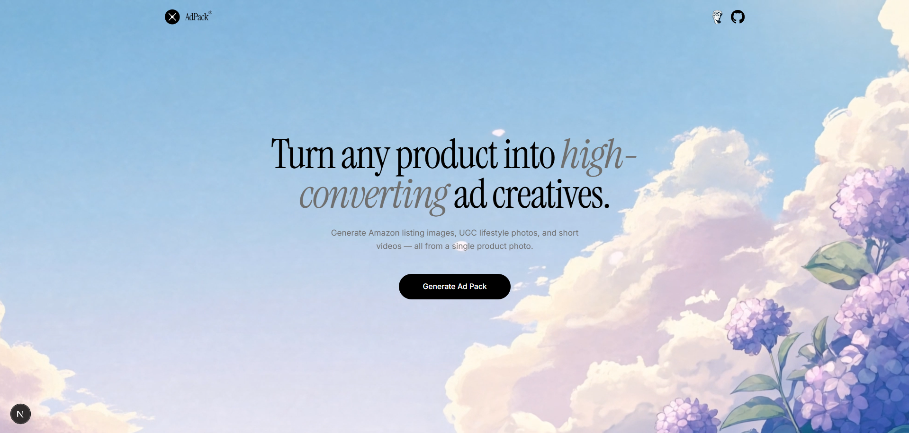
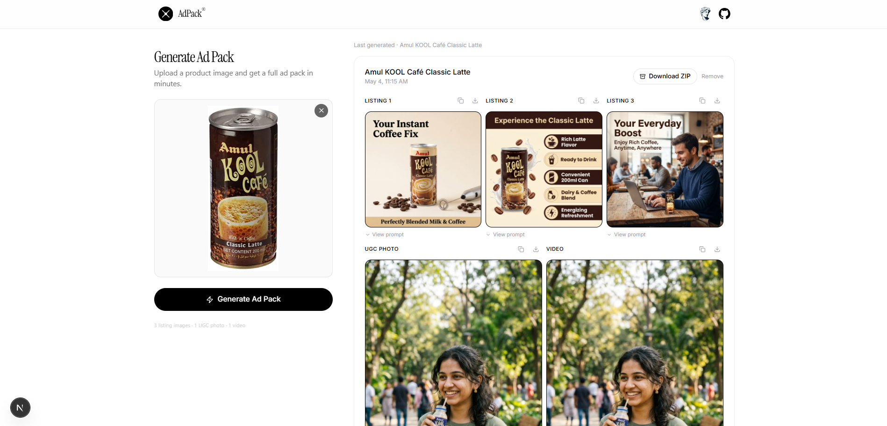

# AdPack AI

Generate a complete Amazon ad pack from a single product photo — three listing images, an in-car UGC photo, and a viral UGC video — in under five minutes.



---

## What it generates

| Asset | Format | Engine |
|---|---|---|
| Listing Image 1 — Hero shot | 1:1 | GPT-Image-2 (KIEAI) |
| Listing Image 2 — Benefits infographic | 1:1 | GPT-Image-2 (KIEAI) |
| Listing Image 3 — Lifestyle context | 1:1 | GPT-Image-2 (KIEAI) |
| UGC Photo — In-car reaction | 9:16 | GPT-Image-2 (KIEAI) |
| UGC Video — In-car with audio | 9:16 | Kling 2.6 (KIEAI) |

All four image tasks generate in parallel. The video starts automatically once the UGC photo completes (it uses it as a reference frame).

---

## Generate page



---

## How it works

1. **Upload** a product photo (JPG, PNG, WebP)
2. **Gemini 2.5 Flash** analyzes the image and writes tailored prompts for all five assets plus a short ad script
3. **KIEAI** generates images using your product as a visual reference; ad script is baked into the video prompt so the person speaks it
4. Assets appear one by one as they complete — click any to open a full-screen carousel
5. **Download** individually or as a single ZIP

---

## Tech stack

- **Next.js 16** (App Router, Turbopack)
- **Tailwind CSS v4**
- **Gemini 2.5 Flash** via OpenRouter — product analysis & prompt generation
- **KIEAI API** — GPT-Image-2 for images, Kling 2.6 for video (with audio)
- **JSZip** — server-side ZIP bundling
- **localStorage** — previously generated packs persist across sessions

---

## Setup

### 1. Clone and install

```bash
git clone https://github.com/your-username/adpack.git
cd adpack
npm install
```

### 2. Environment variables

Create a `.env.local` file in the project root:

```env
KIEAI_API_KEY=your_kieai_api_key
OPENROUTER_API_KEY=your_openrouter_api_key
```

| Variable | Where to get it |
|---|---|
| `KIEAI_API_KEY` | [kie.ai](https://kie.ai) → API Keys |
| `OPENROUTER_API_KEY` | [openrouter.ai](https://openrouter.ai) → Keys |

### 3. Run locally

```bash
npm run dev
```

Open [http://localhost:3000](http://localhost:3000).

### 4. Build for production

```bash
npm run build
npm start
```

---

## Deploy to Vercel

Set `KIEAI_API_KEY` and `OPENROUTER_API_KEY` in **Vercel → Settings → Environment Variables**, then deploy.

```bash
vercel --prod
```

---

## Project structure

```
app/
  page.tsx                  # Landing page
  generate/page.tsx         # Generator UI
  api/
    analyze/route.ts        # Gemini product analysis + prompt generation
    create-task/route.ts    # KIEAI task creation (image + video)
    task-status/route.ts    # KIEAI task polling
    download-pack/route.ts  # Server-side ZIP via JSZip
components/
  generate/
    AssetCard.tsx           # Image/video card with natural-ratio display
    Carousel.tsx            # Full-screen carousel with keyboard nav
    StepTracker.tsx         # 5-step progress indicator
    UploadZone.tsx          # Drag-and-drop image upload
  ui/
    Navbar.tsx
    Skeleton.tsx
lib/
  kieai.ts                  # KIEAI API wrapper (images + Kling video)
```

---

## License

MIT
